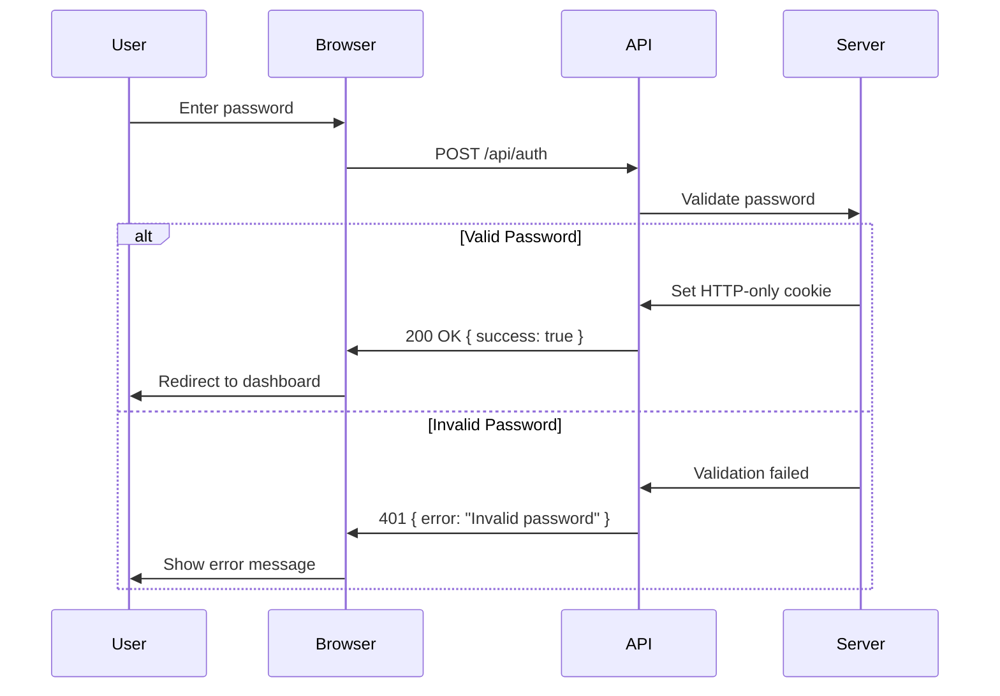
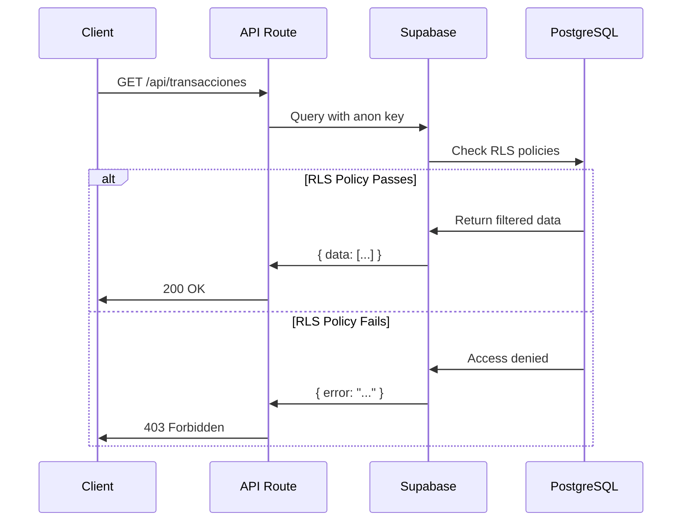

## Overview

Sistema Financiero uses a hybrid authentication approach combining:
- **Supabase Auth** for database-level user authentication (RLS policies)
- **Cookie-based sessions** for dashboard password protection
- **API Keys** for external service integrations (OpenRouter)

## Authentication Methods

### 1. Dashboard Password Authentication

The application uses a simple password-based authentication for dashboard access.

<Note>
  This is a basic authentication layer designed for personal use. For production multi-user deployments, migrate to full Supabase Auth.
</Note>

#### Login Endpoint

```http
POST /api/auth
```

<ParamField body="password" type="string" required>
  The dashboard password configured in `DASHBOARD_PASSWORD` environment variable
</ParamField>

#### Request Example

```typescript
const response = await fetch('/api/auth', {
  method: 'POST',
  headers: { 'Content-Type': 'application/json' },
  body: JSON.stringify({ password: 'your-dashboard-password' })
});

if (response.ok) {
  // Authentication successful
  const data = await response.json();
  console.log(data); // { success: true }
}
```

#### Response

<ResponseField name="success" type="boolean">
  Returns `true` if authentication was successful
</ResponseField>

<ResponseField name="error" type="string">
  Error message if authentication failed (only present on failure)
</ResponseField>

<ResponseField name="debug" type="object">
  Debug information in development mode only
</ResponseField>

**Success Response (200 OK):**

```json
{
  "success": true
}
```

**Error Response (401 Unauthorized):**

```json
{
  "error": "Invalid password",
  "debug": {
    "provided": "wrong-password",
    "expected": "correct-password"
  }
}
```

<Warning>
  Debug information is only returned in development mode (`NODE_ENV === 'development'`). Never expose credentials in production.
</Warning>

#### Session Cookie

On successful authentication, the server sets an HTTP-only cookie:

```typescript
response.cookies.set('dashboard_password', password, {
  httpOnly: true,
  secure: process.env.NODE_ENV === 'production',
  sameSite: 'lax',
  path: '/',
  maxAge: 60 * 60 * 24 * 7, // 7 days
});
```

**Cookie Properties:**

- **Name:** `dashboard_password`
- **Duration:** 7 days
- **HttpOnly:** Yes (JavaScript cannot access)
- **Secure:** Yes in production (HTTPS only)
- **SameSite:** Lax (CSRF protection)

### 2. Supabase Database Authentication

All database operations use Supabase's authentication system for Row Level Security (RLS).

#### Supabase Client Initialization

```typescript
// lib/supabase.ts
import { createClient } from '@supabase/supabase-js'

const supabaseUrl = process.env.NEXT_PUBLIC_SUPABASE_URL
const supabaseAnonKey = process.env.NEXT_PUBLIC_SUPABASE_ANON_KEY

if (!supabaseUrl || !supabaseAnonKey) {
  throw new Error('Missing Supabase environment variables')
}

export const supabase = createClient(supabaseUrl, supabaseAnonKey)
```

#### Using Supabase Client in API Routes

```typescript
// app/api/transacciones/route.ts
import { createClient } from '@supabase/supabase-js'

const supabase = createClient(
  process.env.NEXT_PUBLIC_SUPABASE_URL!,
  process.env.NEXT_PUBLIC_SUPABASE_ANON_KEY!
)

export async function GET(request: Request) {
  const { data, error } = await supabase
    .from('transacciones')
    .select('*')
    .order('fecha', { ascending: false })

  if (error) {
    return NextResponse.json({ error: error.message }, { status: 500 })
  }

  return NextResponse.json({ data })
}
```

### 3. External API Authentication

#### OpenRouter API Key

The application uses OpenRouter for AI-powered features (chat, OCR).

```typescript
// app/api/chat/stream/route.ts
const response = await fetch('https://openrouter.ai/api/v1/chat/completions', {
  method: 'POST',
  headers: {
    'Authorization': `Bearer ${process.env.OPENROUTER_API_KEY}`,
    'Content-Type': 'application/json',
  },
  body: JSON.stringify({
    model: 'google/gemini-2.5-flash',
    messages: messages
  })
});
```

<Warning>
  Never expose `OPENROUTER_API_KEY` in client-side code. Always use server-side API routes.
</Warning>

## Environment Variables

### Required Variables

<ParamField path="NEXT_PUBLIC_SUPABASE_URL" type="string" required>
  Your Supabase project URL
  
  Example: `https://xyzcompany.supabase.co`
</ParamField>

<ParamField path="NEXT_PUBLIC_SUPABASE_ANON_KEY" type="string" required>
  Supabase anonymous/public API key (safe to expose)
  
  Example: `eyJhbGciOiJIUzI1NiIsInR5cCI6IkpXVCJ9...`
</ParamField>

<ParamField path="DASHBOARD_PASSWORD" type="string" required>
  Password for dashboard access (server-side only)
  
  Example: `my-secure-password-2024`
</ParamField>

### Optional Variables

<ParamField path="OPENROUTER_API_KEY" type="string">
  API key for OpenRouter (required only for AI features)
  
  Example: `sk-or-v1-...`
</ParamField>

<ParamField path="NEXT_PUBLIC_SITE_URL" type="string">
  Your application URL (used for OpenRouter attribution)
  
  Example: `http://localhost:3000` or `https://yourdomain.com`
</ParamField>

### Configuration Example

```bash
# .env.local

# Supabase (Required)
NEXT_PUBLIC_SUPABASE_URL=https://your-project.supabase.co
NEXT_PUBLIC_SUPABASE_ANON_KEY=eyJhbGciOiJIUzI1NiIsInR5cCI6IkpXVCJ9...

# Dashboard Authentication (Required)
DASHBOARD_PASSWORD=your-secure-password

# OpenRouter AI (Optional)
OPENROUTER_API_KEY=sk-or-v1-...

# Site URL
NEXT_PUBLIC_SITE_URL=http://localhost:3000
```

## Authentication Flow

### User Login Flow



### API Request Flow with Supabase



## Security Best Practices

### 1. Environment Variable Security

<Warning>
  Never commit `.env.local` to version control. Use `.env.example` for templates only.
</Warning>

```bash
# ✅ Safe to commit
.env.example

# ❌ Never commit
.env.local
.env
.env.production
```

### 2. Cookie Security

- **HttpOnly:** Prevents XSS attacks by making cookies inaccessible to JavaScript
- **Secure:** Ensures cookies are only sent over HTTPS in production
- **SameSite=Lax:** Protects against CSRF attacks

### 3. API Key Management

<Note>
  The `NEXT_PUBLIC_SUPABASE_ANON_KEY` is safe to expose because:
  - It has limited permissions (defined by RLS policies)
  - Cannot bypass Row Level Security
  - Only allows operations permitted by database policies
</Note>

**Server-Side Only Keys:**
- `DASHBOARD_PASSWORD`
- `OPENROUTER_API_KEY`
- Supabase Service Role Key (if used)

### 4. Rate Limiting

Consider implementing rate limiting for the login endpoint:

```typescript
// Example rate limiting logic
const MAX_ATTEMPTS = 5;
const WINDOW_MS = 15 * 60 * 1000; // 15 minutes

const attemptsByIP = new Map();

export async function POST(request: NextRequest) {
  const ip = request.headers.get('x-forwarded-for') || 'unknown';
  
  // Check rate limit
  const attempts = attemptsByIP.get(ip) || [];
  const recentAttempts = attempts.filter(
    time => Date.now() - time < WINDOW_MS
  );
  
  if (recentAttempts.length >= MAX_ATTEMPTS) {
    return NextResponse.json(
      { error: 'Too many attempts. Try again later.' },
      { status: 429 }
    );
  }
  
  // Continue with authentication...
}
```

## Troubleshooting

### Common Authentication Errors

#### "Missing Supabase environment variables"

**Cause:** `NEXT_PUBLIC_SUPABASE_URL` or `NEXT_PUBLIC_SUPABASE_ANON_KEY` not set.

**Solution:**
```bash
# Check your .env.local file
cat .env.local | grep SUPABASE

# Restart development server after adding variables
npm run dev
```

#### "Invalid password" on correct password

**Cause:** Environment variable not loaded or whitespace in password.

**Solution:**
```typescript
// Check in development mode (debug info shown)
const res = await fetch('/api/auth', {
  method: 'POST',
  headers: { 'Content-Type': 'application/json' },
  body: JSON.stringify({ password: 'your-password' })
});

const data = await res.json();
console.log(data.debug); // Shows provided vs expected password
```

#### Supabase queries return empty results

**Cause:** RLS policies blocking access (see [Row Level Security](/api/row-level-security)).

**Solution:**
- Verify user is authenticated
- Check RLS policies in Supabase dashboard
- Ensure `usuario_id` matches `auth.uid()`

## Migration Guide

### Upgrading to Full Supabase Auth

To migrate from password-based auth to full Supabase authentication:

1. **Enable Supabase Auth UI:**

```typescript
import { createClientComponentClient } from '@supabase/auth-helpers-nextjs'

const supabase = createClientComponentClient()

// Sign up
await supabase.auth.signUp({
  email: 'user@example.com',
  password: 'secure-password'
})

// Sign in
await supabase.auth.signInWithPassword({
  email: 'user@example.com',
  password: 'secure-password'
})
```

2. **Update Middleware:**

```typescript
// middleware.ts
import { createMiddlewareClient } from '@supabase/auth-helpers-nextjs'
import { NextResponse } from 'next/server'

export async function middleware(req) {
  const res = NextResponse.next()
  const supabase = createMiddlewareClient({ req, res })
  
  const { data: { session } } = await supabase.auth.getSession()
  
  if (!session && req.nextUrl.pathname !== '/login') {
    return NextResponse.redirect(new URL('/login', req.url))
  }
  
  return res
}
```

3. **Update RLS Policies:** Policies are already configured for Supabase Auth (using `auth.uid()`).

## Next Steps

<CardGroup cols={2}>
  <Card title="Row Level Security" icon="shield-halved" href="/api/row-level-security">
    Learn how RLS policies protect user data
  </Card>
  <Card title="API Endpoints" icon="code" href="/api/transactions">
    Explore available API routes
  </Card>
</CardGroup>