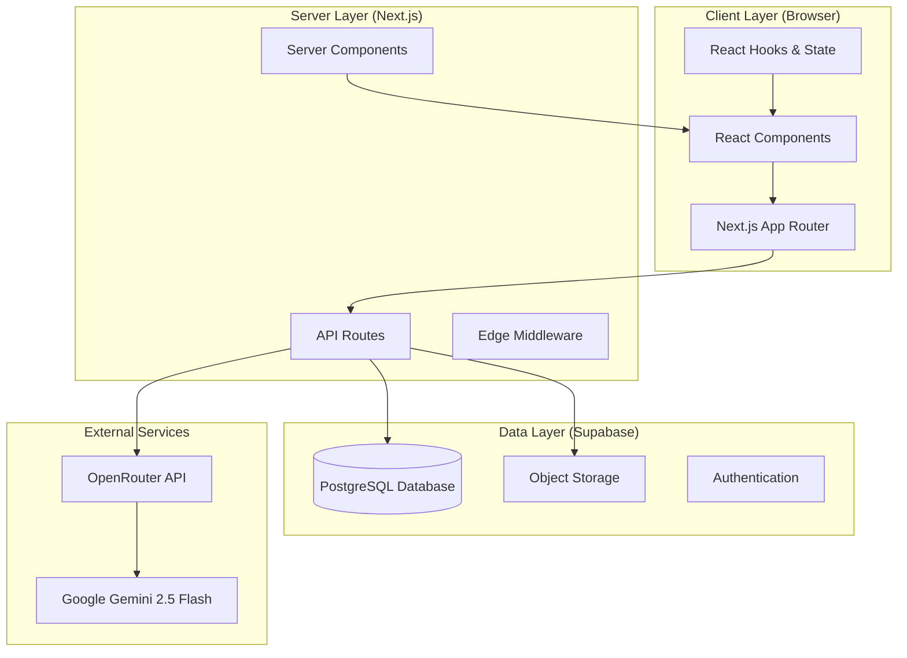
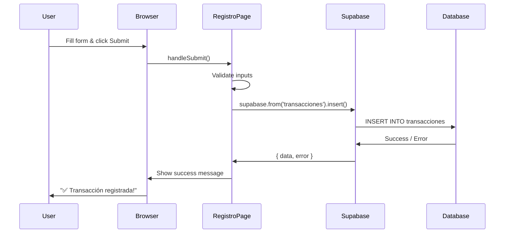
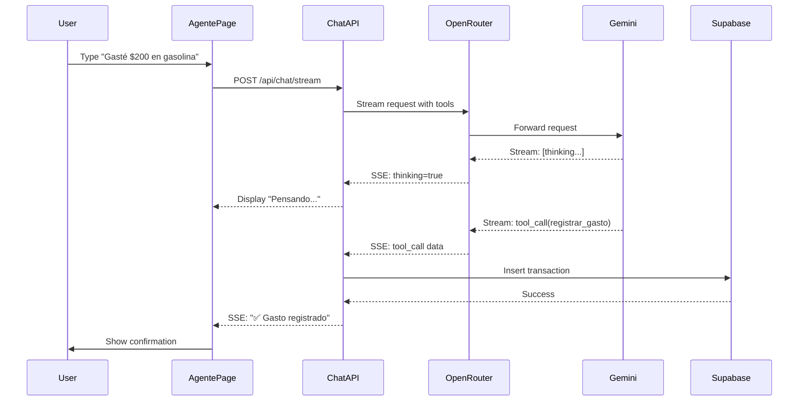
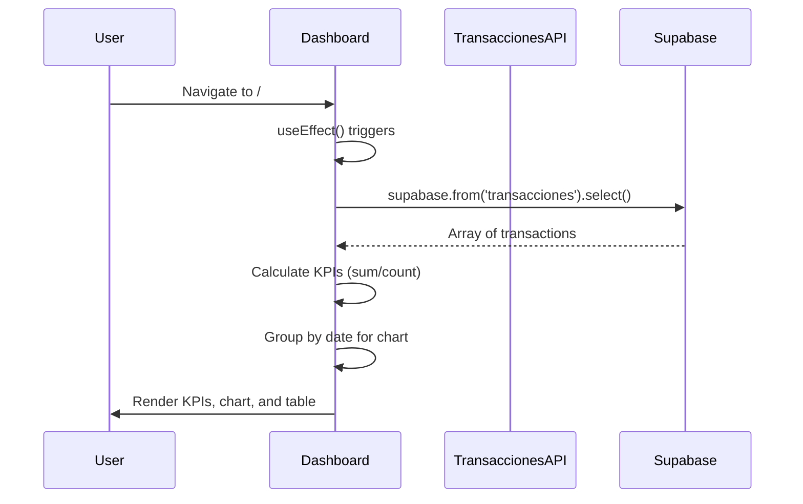

# System Architecture

Sistema Financiero is built as a modern full-stack web application using Next.js 15 with the App Router, React 19, TypeScript, and Supabase PostgreSQL. This guide explains how all the pieces fit together.

## High-Level Overview

The application follows a three-tier architecture:



## Tech Stack Details

### Frontend Technologies

<CardGroup cols={2}>
  <Card title="Next.js 15.5.4" icon="react">
    React framework with App Router for file-based routing and server components
  </Card>
  <Card title="React 19" icon="atom">
    Latest React with improved hooks, concurrent features, and server components
  </Card>
  <Card title="TypeScript 5" icon="code">
    Type-safe development with full IntelliSense and compile-time error checking
  </Card>
  <Card title="Tailwind CSS 4" icon="paintbrush">
    Utility-first CSS framework for rapid UI development with dark mode
  </Card>
</CardGroup>

### Backend Technologies

<CardGroup cols={2}>
  <Card title="Next.js API Routes" icon="server">
    Serverless API endpoints deployed as edge functions
  </Card>
  <Card title="Supabase PostgreSQL" icon="database">
    Managed PostgreSQL with real-time subscriptions and Row Level Security
  </Card>
  <Card title="OpenRouter" icon="route">
    Unified API gateway for accessing multiple LLM providers
  </Card>
  <Card title="Gemini 2.5 Flash" icon="brain">
    Google's fast AI model with vision and function calling capabilities
  </Card>
</CardGroup>

### Supporting Libraries

```json package.json
{
  "dependencies": {
    "@supabase/supabase-js": "^2.58.0",  // Database client
    "chart.js": "^4.5.0",                 // Charting library
    "react-chartjs-2": "^5.3.0",          // React wrapper for Chart.js
    "lucide-react": "^0.544.0",           // Icon library (1000+ icons)
    "next-themes": "^0.4.6",              // Dark mode theming
    "react-markdown": "^10.1.0",          // Markdown rendering
    "mermaid": "^11.12.0"                 // Diagram rendering
  }
}
```

## Project Structure

The codebase is organized following Next.js 15 App Router conventions:

```bash
sistema-financiero-app/
├── app/                          # Next.js App Router
│   ├── layout.tsx               # Root layout with theme provider
│   ├── page.tsx                 # Dashboard (home page)
│   ├── globals.css              # Global styles and Tailwind imports
│   │
│   ├── registro/                # Manual transaction entry
│   │   └── page.tsx
│   │
│   ├── agente-mejorado/         # AI chat interface
│   │   └── page.tsx
│   │
│   ├── corte-diario/            # Daily cut / bulk entry
│   │   └── page.tsx
│   │
│   └── api/                     # Backend API routes
│       ├── transacciones/
│       │   └── route.ts         # GET transactions with filters
│       ├── chat/
│       │   └── stream/
│       │       └── route.ts     # POST streaming AI chat
│       ├── upload-image/
│       │   └── route.ts         # POST OCR image upload
│       └── gastos-recurrentes/
│           ├── route.ts         # GET/POST recurring expenses
│           └── procesar/
│               └── route.ts     # POST process due expenses
│
├── components/                   # React components
│   ├── Header.tsx               # Navigation bar
│   ├── KPICard.tsx              # Metric display cards
│   ├── TrendChart.tsx           # Line chart visualization
│   ├── DataViews.tsx            # Transaction table with filters
│   ├── ThemeProvider.tsx        # Dark mode context
│   └── ThemeToggle.tsx          # Dark mode switcher button
│
├── hooks/                        # Custom React hooks
│   ├── useEnhancedChat.ts       # Chat state management
│   └── useImageUpload.ts        # Image upload to Supabase Storage
│
├── lib/                          # Utilities and configs
│   └── supabase.ts              # Supabase client singleton
│
├── .env.local                    # Environment variables (gitignored)
├── .env.example                  # Template for env vars
├── next.config.ts                # Next.js configuration
├── tailwind.config.ts            # Tailwind CSS configuration
├── tsconfig.json                 # TypeScript configuration
└── package.json                  # Dependencies and scripts
```

## Database Schema

### Tables

Sistema Financiero uses a **single table architecture** for simplicity:

<Info>
  Unlike traditional accounting systems with dozens of normalized tables, this app uses one flexible table with smart indexing.
</Info>

#### transacciones Table

```sql
CREATE TABLE transacciones (
  -- Primary Key
  id UUID PRIMARY KEY DEFAULT uuid_generate_v4(),

  -- Core Fields
  fecha TIMESTAMP NOT NULL DEFAULT NOW(),
  tipo TEXT CHECK (tipo IN ('ingreso', 'gasto')) NOT NULL,
  monto NUMERIC(10, 2) NOT NULL CHECK (monto > 0),
  categoria TEXT NOT NULL,

  -- Optional Details
  concepto TEXT DEFAULT 'Transacción manual',
  descripcion TEXT,
  metodo_pago TEXT CHECK (metodo_pago IN ('Efectivo', 'Tarjeta', 'Transferencia')),
  registrado_por TEXT,
  foto_url TEXT,

  -- Metadata
  usuario_id UUID REFERENCES auth.users(id),
  created_at TIMESTAMP DEFAULT NOW()
);
```

**Field Descriptions:**

| Field | Type | Description | Example |
|-------|------|-------------|----------|
| `id` | UUID | Unique identifier | `550e8400-e29b-41d4-a716-446655440000` |
| `fecha` | TIMESTAMP | Transaction date/time | `2024-03-15 14:30:00` |
| `tipo` | TEXT | Transaction type | `gasto` or `ingreso` |
| `monto` | NUMERIC | Amount (2 decimal places) | `150.50` |
| `categoria` | TEXT | Expense/income category | `Alimentación`, `Salario` |
| `concepto` | TEXT | Brief description | `Compras del súper` |
| `descripcion` | TEXT | Detailed notes | `Pan, leche, huevos` |
| `metodo_pago` | TEXT | Payment method | `Efectivo`, `Tarjeta`, `Transferencia` |
| `registrado_por` | TEXT | Who registered it | `Juan`, `María` |
| `foto_url` | TEXT | Receipt image URL | `https://...supabase.co/storage/.../receipt.jpg` |
| `usuario_id` | UUID | Foreign key to user | `auth.users(id)` |
| `created_at` | TIMESTAMP | Record creation time | `2024-03-15 14:30:00` |

### Indexes

Performance-optimized indexes for common queries:

```sql
-- Speed up date range queries (most common)
CREATE INDEX idx_transacciones_fecha ON transacciones(fecha DESC);

-- Speed up filtering by income/expense type
CREATE INDEX idx_transacciones_tipo ON transacciones(tipo);

-- Speed up user isolation queries (RLS)
CREATE INDEX idx_transacciones_usuario ON transacciones(usuario_id);
```

### Row Level Security (RLS)

User data isolation is enforced at the database level:

```sql
-- Enable RLS on the table
ALTER TABLE transacciones ENABLE ROW LEVEL SECURITY;

-- Users can only read their own transactions
CREATE POLICY "Users can view own transactions"
  ON transacciones FOR SELECT
  USING (auth.uid() = usuario_id);

-- Users can only insert their own transactions
CREATE POLICY "Users can insert own transactions"
  ON transacciones FOR INSERT
  WITH CHECK (auth.uid() = usuario_id);
```

<Warning>
  RLS policies are **critical** for security. Never disable them in production - they prevent users from seeing each other's financial data.
</Warning>

## Data Flow

### User Registers a Transaction (Manual)



Implementation in code:

<CodeGroup>
```tsx app/registro/page.tsx
'use client'

import { useState } from 'react'
import { supabase } from '@/lib/supabase'

export default function RegistroPage() {
  const [monto, setMonto] = useState('')
  const [categoria, setCategoria] = useState('')
  const [tipo, setTipo] = useState<'gasto' | 'ingreso'>('gasto')

  const handleSubmit = async (e: React.FormEvent) => {
    e.preventDefault()

    // Validate inputs
    if (!monto || parseFloat(monto) <= 0) {
      throw new Error('El monto debe ser mayor a 0')
    }
    if (!categoria) {
      throw new Error('Debe seleccionar una categoría')
    }

    // Insert to database
    const { error } = await supabase
      .from('transacciones')
      .insert({
        tipo,
        monto: parseFloat(monto),
        categoria,
        fecha: new Date().toISOString(),
      })

    if (error) throw error

    // Success - reset form
    setMonto('')
    setCategoria('')
  }

  return (
    <form onSubmit={handleSubmit}>
      {/* Form fields */}
    </form>
  )
}
```

```typescript lib/supabase.ts
import { createClient } from '@supabase/supabase-js'

const supabaseUrl = process.env.NEXT_PUBLIC_SUPABASE_URL
const supabaseAnonKey = process.env.NEXT_PUBLIC_SUPABASE_ANON_KEY

if (!supabaseUrl || !supabaseAnonKey) {
  throw new Error('Missing Supabase environment variables')
}

export const supabase = createClient(supabaseUrl, supabaseAnonKey)
```
</CodeGroup>

### User Chats with AI Agent



Implementation of the streaming chat endpoint:

<CodeGroup>
```typescript app/api/chat/stream/route.ts
import { NextRequest } from 'next/server'
import { createClient } from '@supabase/supabase-js'

const supabase = createClient(
  process.env.NEXT_PUBLIC_SUPABASE_URL!,
  process.env.NEXT_PUBLIC_SUPABASE_ANON_KEY!
)

export async function POST(request: NextRequest) {
  const encoder = new TextEncoder()
  const { message } = await request.json()

  const stream = new ReadableStream({
    async start(controller) {
      // Send "thinking" status
      controller.enqueue(
        encoder.encode(`data: ${JSON.stringify({ thinking: true })}\n\n`)
      )

      // Call OpenRouter with function calling
      const response = await fetch('https://openrouter.ai/api/v1/chat/completions', {
        method: 'POST',
        headers: {
          'Authorization': `Bearer ${process.env.OPENROUTER_API_KEY}`,
          'Content-Type': 'application/json',
        },
        body: JSON.stringify({
          model: 'google/gemini-2.5-flash',
          messages: [
            {
              role: 'system',
              content: 'Eres un asistente financiero. Registras gastos e ingresos.'
            },
            { role: 'user', content: message }
          ],
          tools: [
            {
              type: 'function',
              function: {
                name: 'registrar_gasto',
                description: 'Registra un gasto',
                parameters: {
                  type: 'object',
                  properties: {
                    monto: { type: 'number' },
                    categoria: { 
                      type: 'string',
                      enum: ['Alimentación', 'Transporte', 'Vivienda', 'Salud', 'Entretenimiento', 'Educación', 'Otros Gastos']
                    },
                    metodo_pago: {
                      type: 'string',
                      enum: ['Efectivo', 'Tarjeta', 'Transferencia']
                    }
                  },
                  required: ['monto', 'categoria']
                }
              }
            }
          ],
          stream: true,
          thinking_config: {
            max_thinking_tokens: 500  // Enable Gemini's thinking mode
          }
        })
      })

      // Process stream
      const reader = response.body!.getReader()
      let toolCallData = null

      while (true) {
        const { done, value } = await reader.read()
        if (done) break

        // Parse SSE chunks and collect tool calls
        // ... streaming logic ...
      }

      // Execute tool call
      if (toolCallData) {
        const { error } = await supabase.from('transacciones').insert({
          tipo: 'gasto',
          monto: toolCallData.monto,
          categoria: toolCallData.categoria,
          fecha: new Date().toISOString()
        })

        // Send confirmation
        controller.enqueue(
          encoder.encode(`data: ${JSON.stringify({ 
            chunk: '✅ Gasto registrado exitosamente!' 
          })}\n\n`)
        )
      }

      controller.close()
    }
  })

  return new Response(stream, {
    headers: {
      'Content-Type': 'text/event-stream',
      'Cache-Control': 'no-cache',
    },
  })
}
```
</CodeGroup>

### Dashboard Loads Data



Implementation:

<CodeGroup>
```tsx app/page.tsx
'use client'

import { useEffect, useState } from 'react'
import { supabase } from '@/lib/supabase'
import { KPICard } from '@/components/KPICard'
import { TrendChart } from '@/components/TrendChart'

export default function HomePage() {
  const [kpis, setKpis] = useState({
    ingresos: 0,
    gastos: 0,
    balance: 0,
    transacciones: 0,
  })

  useEffect(() => {
    fetchKPIs()
  }, [])

  const fetchKPIs = async () => {
    // Calculate date range (last 30 days)
    const startDate = new Date()
    startDate.setDate(startDate.getDate() - 30)
    const endDate = new Date()

    // Fetch transactions
    const { data } = await supabase
      .from('transacciones')
      .select('*')
      .gte('fecha', startDate.toISOString())
      .lte('fecha', endDate.toISOString())

    if (data) {
      // Calculate totals
      let totalIngresos = 0
      let totalGastos = 0

      data.forEach(row => {
        const monto = parseFloat(row.monto || 0)
        if (row.tipo === 'ingreso') {
          totalIngresos += monto
        } else if (row.tipo === 'gasto') {
          totalGastos += monto
        }
      })

      setKpis({
        ingresos: totalIngresos,
        gastos: totalGastos,
        balance: totalIngresos - totalGastos,
        transacciones: data.length,
      })
    }
  }

  return (
    <main>
      <div className="grid grid-cols-4 gap-6">
        <KPICard title="Ingresos" value={kpis.ingresos} icon="income" color="green" />
        <KPICard title="Gastos" value={kpis.gastos} icon="expense" color="red" />
        <KPICard title="Balance" value={kpis.balance} icon="balance" color={kpis.balance > 0 ? 'green' : 'red'} />
        <KPICard title="Transacciones" value={kpis.transacciones} icon="transactions" color="blue" />
      </div>
      <TrendChart vista="mensual" />
    </main>
  )
}
```

```tsx components/TrendChart.tsx
'use client'

import { useEffect, useState } from 'react'
import { Line } from 'react-chartjs-2'
import { supabase } from '@/lib/supabase'

export function TrendChart({ vista = 'mensual' }) {
  const [chartData, setChartData] = useState(null)

  useEffect(() => {
    fetchTrendData()
  }, [vista])

  const fetchTrendData = async () => {
    const startDate = new Date()
    startDate.setMonth(startDate.getMonth() - 12)

    const { data } = await supabase
      .from('transacciones')
      .select('*')
      .gte('fecha', startDate.toISOString())
      .order('fecha', { ascending: true })

    if (data) {
      // Group by date
      const groupedByDate = {}

      data.forEach(row => {
        const fecha = new Date(row.fecha).toISOString().split('T')[0]
        if (!groupedByDate[fecha]) {
          groupedByDate[fecha] = { ingresos: 0, gastos: 0 }
        }

        const monto = parseFloat(row.monto || 0)
        if (row.tipo === 'ingreso') {
          groupedByDate[fecha].ingresos += monto
        } else if (row.tipo === 'gasto') {
          groupedByDate[fecha].gastos += monto
        }
      })

      // Convert to Chart.js format
      const sortedDates = Object.keys(groupedByDate).sort()
      const labels = sortedDates.map(fecha =>
        new Date(fecha).toLocaleDateString('es-MX', { day: '2-digit', month: 'short' })
      )
      const ingresos = sortedDates.map(fecha => groupedByDate[fecha].ingresos)
      const gastos = sortedDates.map(fecha => groupedByDate[fecha].gastos)

      setChartData({
        labels,
        datasets: [
          {
            label: 'Ingresos',
            data: ingresos,
            borderColor: 'rgb(34, 197, 94)',
            backgroundColor: 'rgba(34, 197, 94, 0.1)',
          },
          {
            label: 'Gastos',
            data: gastos,
            borderColor: 'rgb(239, 68, 68)',
            backgroundColor: 'rgba(239, 68, 68, 0.1)',
          },
        ],
      })
    }
  }

  if (!chartData) return <div>Cargando gráfica...</div>

  return <Line data={chartData} options={{ responsive: true }} />
}
```
</CodeGroup>

## Component Architecture

### Core Components

<CardGroup cols={2}>
  <Card title="Header" icon="bars">
    Navigation bar with theme toggle and route links
  </Card>
  <Card title="KPICard" icon="gauge">
    Reusable metric display card with glassmorphism effects
  </Card>
  <Card title="TrendChart" icon="chart-line">
    Line chart visualization using Chart.js
  </Card>
  <Card title="DataViews" icon="table">
    Transaction table with filtering and grouping
  </Card>
</CardGroup>

### Custom Hooks

**useEnhancedChat** - Manages AI chat state:

```typescript hooks/useEnhancedChat.ts
import { useState } from 'react'

export function useEnhancedChat() {
  const [messages, setMessages] = useState<Message[]>([])
  const [isLoading, setIsLoading] = useState(false)
  const [isThinking, setIsThinking] = useState(false)

  const sendMessage = async (content: string) => {
    setIsLoading(true)

    // Call streaming API
    const response = await fetch('/api/chat/stream', {
      method: 'POST',
      body: JSON.stringify({ message: content })
    })

    const reader = response.body!.getReader()
    let buffer = ''

    while (true) {
      const { done, value } = await reader.read()
      if (done) break

      // Parse SSE events
      // ... handle thinking, chunks, and done events ...
    }

    setIsLoading(false)
  }

  return { messages, sendMessage, isLoading, isThinking }
}
```

## API Endpoints

### GET /api/transacciones

Fetch transactions with optional filters:

**Query Parameters:**
- `vista` - Time view: `diaria`, `semanal`, `mensual`, `personalizada`
- `fecha_inicio` - Start date for custom range (ISO 8601)
- `fecha_fin` - End date for custom range (ISO 8601)

**Response:**
```json
{
  "data": [
    {
      "id": "550e8400-e29b-41d4-a716-446655440000",
      "fecha": "2024-03-15T14:30:00Z",
      "tipo": "gasto",
      "monto": 150.50,
      "categoria": "Alimentación",
      "concepto": "Compras del súper",
      "metodo_pago": "Tarjeta"
    }
  ],
  "vista": "mensual"
}
```

### POST /api/chat/stream

Streaming AI chat endpoint with function calling:

**Request Body:**
```json
{
  "message": "Gasté $200 en gasolina",
  "messages": [], // Optional chat history
  "images": []    // Optional receipt images
}
```

**Response:** Server-Sent Events (SSE)
```
data: {"thinking":true}

data: {"chunk":"Perfecto, voy a registrar ese gasto..."}

data: {"chunk":"✅ Gasto registrado exitosamente!"}

data: {"done":true}
```

## Performance Optimizations

### Database Indexing

<Steps>
  <Step title="Date Range Queries">
    Index on `fecha DESC` speeds up dashboard and chart queries
  </Step>
  <Step title="Type Filtering">
    Index on `tipo` speeds up income vs expense separation
  </Step>
  <Step title="User Isolation">
    Index on `usuario_id` speeds up RLS policy enforcement
  </Step>
</Steps>

### Frontend Optimizations

- **Dynamic Imports**: Chart.js loaded only when needed to reduce bundle size
- **React Server Components**: Static content pre-rendered on server
- **Image Optimization**: Next.js automatic image optimization for receipts
- **Dark Mode**: CSS variables with zero-JS toggle

### API Optimizations

- **Streaming Responses**: SSE reduces perceived latency for AI chat
- **Query Limits**: Max 500 transactions per request prevents timeout
- **Date Range Filters**: Queries only relevant time periods

## Security Considerations

<Warning>
  **Never expose sensitive credentials!** All secrets must be in environment variables, never hardcoded.
</Warning>

### Environment Variables

```bash
# Client-side (exposed to browser)
NEXT_PUBLIC_SUPABASE_URL=https://xxx.supabase.co
NEXT_PUBLIC_SUPABASE_ANON_KEY=eyJ...  # Safe to expose (RLS protects data)

# Server-side only (never exposed)
OPENROUTER_API_KEY=sk-or-v1-...      # Keep secret!
```

### Row Level Security

RLS ensures users can't access each other's data:

```sql
-- Every query automatically includes: WHERE usuario_id = auth.uid()
SELECT * FROM transacciones WHERE fecha > '2024-01-01'
-- Becomes:
SELECT * FROM transacciones 
WHERE fecha > '2024-01-01' 
  AND usuario_id = auth.uid()  -- Added by RLS
```

## Deployment

### Vercel (Recommended)

<Steps>
  <Step title="Push to GitHub">
    Commit your code and push to a GitHub repository
  </Step>
  <Step title="Import to Vercel">
    Go to [vercel.com](https://vercel.com) and import your repo
  </Step>
  <Step title="Set Environment Variables">
    Add all variables from `.env.local` to Vercel project settings
  </Step>
  <Step title="Deploy">
    Vercel auto-deploys on every push to main branch
  </Step>
</Steps>

### Environment-Specific Configuration

```typescript next.config.ts
import type { NextConfig } from 'next'

const nextConfig: NextConfig = {
  reactStrictMode: true,
  images: {
    domains: ['your-project.supabase.co'], // Allow Supabase images
  },
}

export default nextConfig
```

## Extending the System

### Adding a New Transaction Field

<Steps>
  <Step title="Update Database Schema">
    ```sql
    ALTER TABLE transacciones ADD COLUMN new_field TEXT;
    ```
  </Step>
  <Step title="Update TypeScript Interface">
    ```typescript
    interface Transaccion {
      // ... existing fields ...
      new_field: string
    }
    ```
  </Step>
  <Step title="Update Forms">
    Add input field to `app/registro/page.tsx`
  </Step>
  <Step title="Update AI Function Schema">
    Add to tool parameters in `app/api/chat/stream/route.ts`
  </Step>
</Steps>

### Adding a New Category

Categories are hardcoded arrays - no database changes needed:

```typescript
// In app/registro/page.tsx and app/api/chat/stream/route.ts
const CATEGORIAS_GASTOS = [
  'Alimentación',
  'Transporte',
  'Vivienda',
  'Salud',
  'Entretenimiento',
  'Educación',
  'Otros Gastos',
  'Nueva Categoría'  // ← Add here
]
```

### Switching AI Models

Change the model in the API route:

```typescript
// app/api/chat/stream/route.ts
const response = await fetch('https://openrouter.ai/api/v1/chat/completions', {
  body: JSON.stringify({
    model: 'anthropic/claude-3.5-sonnet',  // ← Change model here
    // Available: 'openai/gpt-4o', 'meta-llama/llama-3.1-70b', etc.
  })
})
```

## Summary

Sistema Financiero's architecture prioritizes:

- **Simplicity**: Single table, minimal dependencies
- **Security**: RLS, environment variables, type safety
- **Performance**: Indexed queries, streaming responses, optimized bundles
- **Developer Experience**: TypeScript, hot reload, clear file structure
- **User Experience**: Real-time updates, responsive design, dark mode

<CardGroup cols={2}>
  <Card title="Back to Introduction" icon="arrow-left" href="/introduction">
    Review what Sistema Financiero does
  </Card>
  <Card title="Quick Start Guide" icon="rocket" href="/quickstart">
    Set up your own instance
  </Card>
</CardGroup>