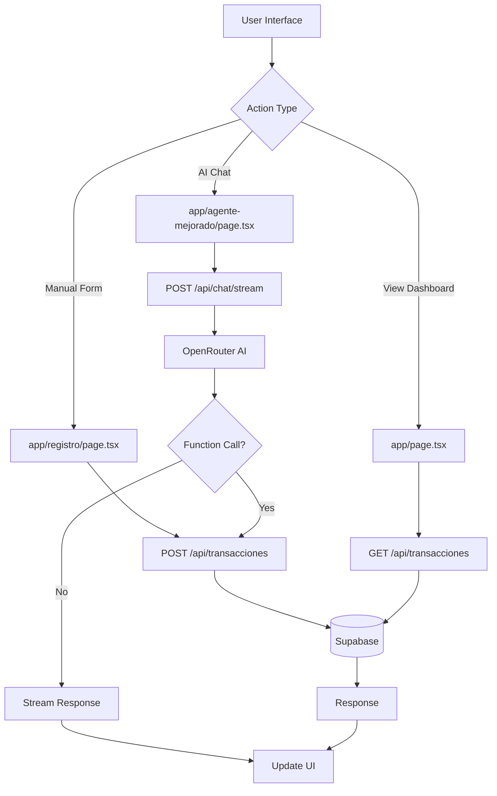

## Project Overview

Sistema Financiero is built with **Next.js 15** using the App Router architecture, TypeScript, and Supabase for the database. This guide will help you navigate the codebase and understand how everything fits together.

## Technology Stack

| Layer | Technology | Purpose |
|-------|-----------|----------|
| **Framework** | Next.js 15.5.4 | Full-stack React framework |
| **Language** | TypeScript 5 | Type-safe JavaScript |
| **Database** | PostgreSQL (Supabase) | Data persistence |
| **Styling** | Tailwind CSS 4 | Utility-first CSS |
| **Charts** | Chart.js + react-chartjs-2 | Data visualization |
| **Icons** | Lucide React | Icon library |
| **AI** | OpenRouter API | Multi-LLM gateway |

## Directory Structure

```
sistema-financiero-app/
├── app/                          # Next.js App Router
│   ├── page.tsx                 # 📊 Dashboard (home page)
│   ├── layout.tsx               # Root layout with providers
│   ├── registro/                # Manual transaction form
│   │   └── page.tsx
│   ├── agente-mejorado/         # AI chat interface
│   │   └── page.tsx
│   ├── corte-diario/            # Daily bulk entry
│   │   └── page.tsx
│   ├── gastos-recurrentes/      # Recurring expenses
│   │   └── page.tsx
│   ├── report/                  # Financial reports
│   │   └── page.tsx
│   ├── report-mvp/              # Minimal report view
│   │   └── page.tsx
│   ├── upload-excel/            # Excel import
│   │   └── page.tsx
│   ├── login/                   # Authentication
│   │   └── page.tsx
│   └── api/                     # Backend API routes
│       ├── transacciones/
│       │   └── route.ts         # GET/POST transactions
│       ├── chat/
│       │   ├── route.ts         # Basic chat endpoint
│       │   └── stream/
│       │       └── route.ts     # Streaming AI chat
│       ├── upload-image/
│       │   └── route.ts         # OCR for receipts
│       ├── upload-excel/
│       │   └── route.ts         # Excel import processing
│       ├── gastos-recurrentes/
│       │   ├── route.ts         # Recurring expenses CRUD
│       │   └── procesar/
│       │       └── route.ts     # Process due expenses
│       └── auth/
│           └── route.ts         # Authentication handler
│
├── components/                   # Reusable React components
│   ├── Header.tsx               # Navigation bar
│   ├── KPICard.tsx              # Metric display cards
│   ├── TrendChart.tsx           # Line chart for trends
│   ├── DataViews.tsx            # Transaction table with filters
│   ├── ThemeProvider.tsx        # Dark mode context
│   ├── ThemeToggle.tsx          # Dark/light mode switch
│   └── Mermaid.tsx              # Diagram renderer
│
├── hooks/                        # Custom React hooks
│   ├── useEnhancedChat.ts       # AI chat state management
│   └── useImageUpload.ts        # Image upload to Supabase Storage
│
├── lib/                          # Utility functions and configs
│   └── supabase.ts              # Supabase client singleton
│
├── .env.example                  # Environment variables template
├── .env.local                    # Your secrets (git-ignored)
├── .gitignore                    # Git ignore rules
├── package.json                  # Dependencies and scripts
├── tsconfig.json                 # TypeScript configuration
├── tailwind.config.ts            # Tailwind CSS settings
├── next.config.ts                # Next.js configuration
├── postcss.config.mjs            # PostCSS plugins
└── README.md                     # Project documentation
```

## Core Directories

### `/app` - Application Pages

Next.js App Router uses file-based routing. Each folder represents a route:

<Card title="app/page.tsx" icon="chart-line">
  **Dashboard** - Main page displaying KPIs, charts, and transaction history
  
  **Key Features:**
  - Fetches transactions from `/api/transacciones`
  - Calculates totals (income, expenses, balance)
  - Renders `TrendChart` and `DataViews` components
  - Date range filtering (daily, weekly, monthly)
  
  **Location:** `app/page.tsx`
</Card>

<Card title="app/registro/page.tsx" icon="file-edit">
  **Manual Registration** - Form-based transaction entry
  
  **Key Features:**
  - Type selection (income/expense)
  - Category dropdown
  - Payment method selection
  - Optional receipt photo upload
  - Form validation
  
  **Location:** `app/registro/page.tsx`
</Card>

<Card title="app/agente-mejorado/page.tsx" icon="bot">
  **AI Agent** - Natural language transaction entry
  
  **Key Features:**
  - Chat interface with streaming responses
  - OCR for receipt scanning
  - Function calling to register transactions
  - Uses `useEnhancedChat` hook
  
  **Location:** `app/agente-mejorado/page.tsx`
</Card>

### `/app/api` - Backend API Routes

Serverless functions that run on the server:

#### `api/transacciones/route.ts`

**Purpose:** Fetch and create transactions

**Endpoints:**
- `GET /api/transacciones?vista=mensual&mes=2024-03`
  - Returns transactions for specified period
  - Supports: `diaria`, `semanal`, `mensual`, `personalizada`
- `POST /api/transacciones`
  - Creates new transaction
  - Validates required fields

**Key Code:**
```typescript
export async function GET(request: Request) {
  const { searchParams } = new URL(request.url);
  const vista = searchParams.get('vista') || 'mensual';
  
  // Query Supabase based on date range
  const { data, error } = await supabase
    .from('transacciones')
    .select('*')
    .order('fecha', { ascending: false });
    
  return Response.json(data);
}
```

#### `api/chat/stream/route.ts`

**Purpose:** AI chat with function calling

**How it works:**
1. Receives user message
2. Sends to OpenRouter (Gemini 2.5 Flash)
3. AI can call `registrar_gasto` or `registrar_ingreso` functions
4. Inserts transaction to Supabase
5. Streams response back to client

**Key Features:**
- Server-Sent Events (SSE) for streaming
- Function calling for transaction registration
- Error handling and validation

#### `api/upload-image/route.ts`

**Purpose:** OCR for receipt scanning

**Process:**
1. Receives image file
2. Uploads to Supabase Storage
3. Sends to Gemini Vision API
4. Extracts: amount, category, date, description
5. Returns structured data

### `/components` - UI Components

#### `KPICard.tsx`

**Purpose:** Display metric cards (income, expenses, balance)

**Props:**
```typescript
interface KPICardProps {
  titulo: string;        // Card title
  valor: string;         // Main value to display
  icono: React.ReactNode; // Lucide icon
  color: string;         // Tailwind color class
}
```

**Usage:**
```typescript
<KPICard
  titulo="Ingresos"
  valor="$15,000"
  icono={<TrendingUp />}
  color="text-green-600"
/>
```

#### `TrendChart.tsx`

**Purpose:** Line chart showing income vs expenses over time

**Dependencies:**
- Chart.js
- react-chartjs-2

**Features:**
- Responsive design
- Dark mode support
- Customizable date grouping
- Tooltips with formatted currency

#### `DataViews.tsx`

**Purpose:** Transaction table with filtering and grouping

**Features:**
- Group by date
- Filter by type (income/expense)
- Filter by category
- Search by description
- Date range filtering
- Sort by date/amount

**Location:** `components/DataViews.tsx` (24,645 bytes - largest component)

#### `Header.tsx`

**Purpose:** Top navigation bar

**Features:**
- Logo and app name
- Navigation links (Dashboard, Register, AI Agent, Reports)
- Theme toggle button
- Responsive mobile menu

### `/hooks` - Custom Hooks

#### `useEnhancedChat.ts`

**Purpose:** Manage AI chat state and streaming

**Returns:**
```typescript
{
  messages: Message[];           // Chat history
  input: string;                 // Current input
  isLoading: boolean;            // Loading state
  sendMessage: (text: string) => void;
  uploadImage: (file: File) => void;
}
```

**Features:**
- Handles streaming responses
- Parses Server-Sent Events
- Manages message history
- Error handling

#### `useImageUpload.ts`

**Purpose:** Upload images to Supabase Storage

**Process:**
1. Validates file type (image/*)
2. Generates unique filename
3. Uploads to `facturas` bucket
4. Returns public URL

### `/lib` - Utilities

#### `supabase.ts`

**Purpose:** Supabase client configuration

**Exports:**
```typescript
import { createClient } from '@supabase/supabase-js';

export const supabase = createClient(
  process.env.NEXT_PUBLIC_SUPABASE_URL!,
  process.env.NEXT_PUBLIC_SUPABASE_ANON_KEY!
);
```

**Usage:**
```typescript
import { supabase } from '@/lib/supabase';

const { data, error } = await supabase
  .from('transacciones')
  .select('*');
```

## Data Flow Architecture



## Database Schema

### `transacciones` Table

The **only table** in the database:

| Column | Type | Description |
|--------|------|-------------|
| `id` | UUID | Primary key |
| `fecha` | TIMESTAMP | Transaction date |
| `tipo` | TEXT | `'ingreso'` or `'gasto'` |
| `monto` | NUMERIC(10,2) | Amount (always positive) |
| `categoria` | TEXT | Category name |
| `concepto` | TEXT | Short description |
| `descripcion` | TEXT | Detailed description |
| `metodo_pago` | TEXT | Payment method |
| `registrado_por` | TEXT | Source (manual/AI/OCR) |
| `foto_url` | TEXT | Receipt image URL |
| `usuario_id` | UUID | User reference |
| `created_at` | TIMESTAMP | Record creation time |

**Indexes:**
- `idx_transacciones_fecha` - On `fecha DESC` for fast date queries
- `idx_transacciones_tipo` - On `tipo` for filtering
- `idx_transacciones_usuario` - On `usuario_id` for RLS

## Configuration Files

### `package.json`

**Key dependencies:**
- `next@15.5.4` - Framework
- `react@19.1.0` - UI library
- `@supabase/supabase-js@^2.58.0` - Database client
- `chart.js@^4.5.0` - Charting library
- `lucide-react@^0.544.0` - Icons
- `next-themes@^0.4.6` - Dark mode

**Scripts:**
```json
{
  "dev": "next dev",      // Development server
  "build": "next build",  // Production build
  "start": "next start"   // Serve production build
}
```

### `tsconfig.json`

TypeScript configuration with path aliases:

```json
{
  "compilerOptions": {
    "paths": {
      "@/*": ["./*"]  // Import with @/components/...
    }
  }
}
```

### `tailwind.config.ts`

Tailwind CSS with custom theme:

```typescript
export default {
  content: [
    './app/**/*.{js,ts,jsx,tsx,mdx}',
    './components/**/*.{js,ts,jsx,tsx,mdx}',
  ],
  theme: {
    extend: {
      // Custom colors, fonts, etc.
    },
  },
};
```

## Key Files Reference

| File | Lines | Purpose | When to Modify |
|------|-------|---------|----------------|
| `app/page.tsx` | ~150 | Dashboard with KPIs | Change layout or KPI logic |
| `components/DataViews.tsx` | 800+ | Transaction table | Add filters or columns |
| `app/api/chat/stream/route.ts` | ~200 | AI chat endpoint | Change AI behavior |
| `app/api/transacciones/route.ts` | ~100 | Transaction CRUD | Modify data fetching |
| `hooks/useEnhancedChat.ts` | ~150 | Chat state management | Add chat features |
| `components/TrendChart.tsx` | ~130 | Charts visualization | Change chart types |
| `lib/supabase.ts` | ~10 | Database client | Change DB connection |

## Environment Variables

### Required Variables

```env
# Supabase (REQUIRED)
NEXT_PUBLIC_SUPABASE_URL=https://xxx.supabase.co
NEXT_PUBLIC_SUPABASE_ANON_KEY=eyJhbGciOiJIUzI1NiIsInR5cCI6IkpXVCJ9...

# OpenRouter (OPTIONAL - for AI features)
OPENROUTER_API_KEY=sk-or-v1-...

# Site URL (for OpenRouter attribution)
NEXT_PUBLIC_SITE_URL=http://localhost:3000
```

<Note>
  Variables prefixed with `NEXT_PUBLIC_` are exposed to the browser. Keep sensitive keys without this prefix.
</Note>

## Next Steps

<Card title="Start Contributing" icon="code" href="/development/contributing">
  Learn how to make your first contribution
</Card>

<Card title="API Reference" icon="webhook" href="/api/transactions">
  Explore the API endpoints
</Card>

<Card title="Quick Start" icon="rocket" href="/quickstart">
  Set up your development environment
</Card>